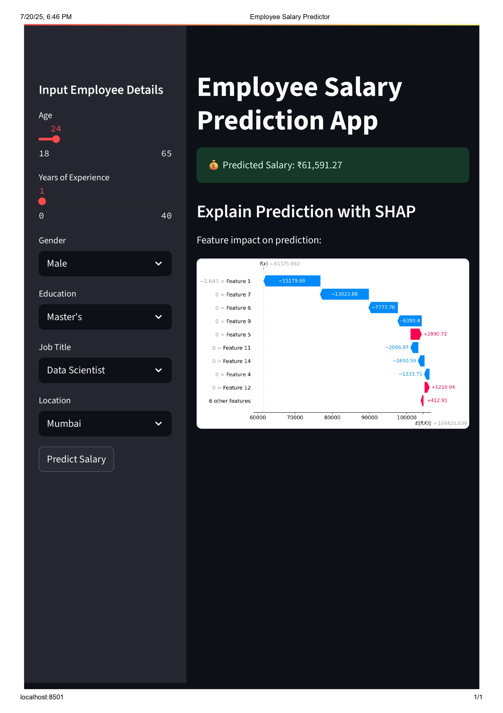

# Employee Salary Prediction App

## Overview
This project predicts employee salaries based on various input features such as age, years of experience, gender, education level, job title, and location. It leverages a Random Forest Regression machine learning model trained on real salary data.

The project includes:

- A trained ML model saved as a pipeline with preprocessing.
- A Streamlit web application with an interactive UI for users to input details and get salary predictions.
- SHAP explainability visualizations to interpret how features impact individual salary predictions.
- Exploratory Data Analysis (EDA) with visual graphs to understand the dataset distribution and trends.


## Demo




## Features
- User-friendly input panel to select employee features.
- Real-time salary prediction based on user inputs.
- Interactive SHAP waterfall plot to explain feature importance for each prediction.
- Visual EDA plots showing salary distribution, salary by job title, and salary by education level.
- Responsive and attractive UI with a custom background image.

## Project Structure
```
SalaryPrediction/
│
├── app/
│   ├── streamlit_app.py        # Streamlit frontend app
│   ├── background.jpg          # Background image used in app
│
├── data/
│   └── salary_prediction_data.csv  # Dataset used for training and EDA
│
├── model/
│   └── salary_model.pkl        # Trained Random Forest model pipeline
│
├── train_model.py              # Script to train and save the model
├── utils.py                   # Utility functions for prediction and SHAP explainability
├── requirements.txt            # Python dependencies
├── README.md                   # Project documentation (this file)
```

## Setup and Installation
Clone the repository
```bash
git clone https://github.com/ShewaleParth/Salary_Prediction.git
cd Salary_Prediction
```

Create and activate a Python virtual environment (optional but recommended)
```bash
python -m venv venv
# Windows
venv\Scripts\activate
# Linux/macOS
source venv/bin/activate
```

Install dependencies
```bash
pip install -r requirements.txt
```

## Running the App Locally
Make sure the trained model (`salary_model.pkl`) and dataset (`salary_prediction_data.csv`) are in the correct folders (`model/` and `data/` respectively).

Run the Streamlit app:
```bash
streamlit run app/streamlit_app.py
python -m streamlit run "/streamlit_app.py"

```

Your app will open in the browser, typically at http://localhost:8501

## Training the Model
To retrain the model with the dataset:
```bash
python train_model.py
```

This will train the Random Forest model, evaluate it, and save the pipeline to `model/salary_model.pkl`.

## Usage
- Use the sidebar inputs to enter employee details.
- Click **Predict Salary** to get the predicted salary and SHAP explainability plot.
- Explore the EDA visualizations on the main page.

## Dependencies
- Python 3.8+
- pandas
- scikit-learn
- joblib
- streamlit
- matplotlib
- seaborn
- shap
- IPython (required for SHAP visuals)

## License
This project is licensed under the MIT License - see the LICENSE file for details.

## Author
Parth Shewale  
GitHub: [ShewaleParth](https://github.com/ShewaleParth)  
Email: sparth7972@gmail.com

## Acknowledgements
- Kaggle Dataset (replace with actual)
- SHAP Python library for model interpretability
- Streamlit for easy web app creation
